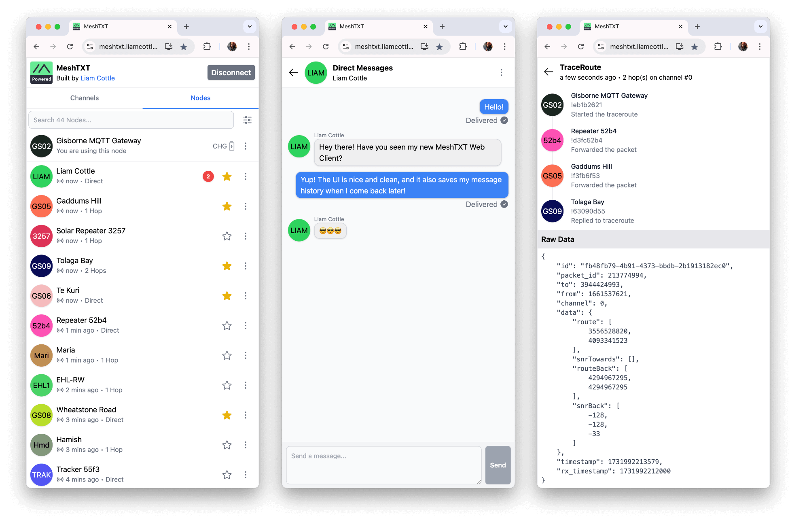

<h2 align="center">MeshTXT</h2>

<p align="center">
<a href="https://discord.gg/K55zeZyHKK"></a>
<a href="https://twitter.com/liamcottle"></a>
<br/>
<a href="https://ko-fi.com/liamcottle"></a>
<a href="./donate.md"></a>
</p>

A simple, mobile friendly, web based [Meshtastic](https://meshtastic.org/) client developed by [Liam Cottle](https://liamcottle.com)



## What can it do?

- Connect to a Meshtastic device over Bluetooth, Serial and HTTP
- Send and receive text messages on existing channels
- Send and receive direct messages with known nodes
- Send and receive node info on demand with a specific node
- Display information about a specific node
- Perform and visualise trace routes to other nodes
- Saves messages and trace routes to database so they survive page reloads
- Uses a unique database for each node you connect so message history is separated
- Mark and unmark a node as a favourite
- Filter nodes to only show favourites
- Allows you to run a server directly from a meshtasticd (Linux Native) device
- Allows file transfers between MeshTXT clients
- Allows pinging a node to see how long it took to respond and how many hops away it is
- Has a basic implementation of remote management, such as configuring user info and channels

> Note: database state is saved in your browser, and is not shared across other browsers or devices. Maybe the server script could support a local SQLite database in the future.

## Is there a hosted version?

Yes! I have a hosted web client available at https://meshtxt.liamcottle.net

I would however suggest that you self host this so you can still use it when the internet is down.

Sometime in the future I may add support for caching of the PWA assets, but for now this is not implemented.

Do note that connecting to your Meshtastic device over HTTP has some limitations due to CORS. Consider using the [server.js](./server.js) script to resolve these issues.

## Running Locally

```
git clone https://github.com/liamcottle/meshtxt
cd meshtxt
npm install
npm run dev
```

## Running with Meshtastic Linux Native

If you have a Linux Native `meshtasticd` setup, you can install and run MeshTXT directly on the same hardware.

There are a couple of options for doing this:

- Changing `RootPath` in `/etc/meshtasticd/config.yaml` to point to MeshTXT instead of the bundled Web Client.
- Running [server.js](./server.js) as a separate process.

**Changing RootPath**

This is the easiest approach, but it means you lose access to the bundled Meshtastic web client that comes with `meshtasticd`.

If you'd like to do this, edit `/etc/meshtasticd/config.yaml` and update it to the following:

```
Webserver:
  Port: 443
  #RootPath: /usr/share/doc/meshtasticd/web
  RootPath: /home/liamcottle/meshtxt/dist
```

> Note: make sure to update `/home/liamcottle/meshtxt/dist` to the `dist` folder where you cloned the repo.

You'll also need to build the MeshTXT web app.

```
npm run build
```

Then make sure to restart the `meshtasticd` service.

```
service meshtasticd restart
```

Now when you navigate to your `meshtasticd` web server, it will serve MeshTXT.

**Running server.js**

This approach allows you to run the original web client as-is, while running MeshTXT as a separate process on a different port.

When running the server, it will automatically proxy `fromradio` and `toradio` requests to the internal `meshtasticd` web server as well as serve the MeshTXT web UI.

The server needs to run an HTTP proxy internally to allow the MeshTXT web UI to access the `fromradio` and `toradio` APIs from the same origin. This is important to bypass CORS restrictions in web browsers.

If you want to proxy to a `meshtasticd` instance on another device, you can use the `--meshtastic-api-url` flag as shown in the example further down.

It is up to you to roll your own HTTPS support if you want it. I generally put all of my internal HTTP servers behind Caddy, which provides automatic HTTPS on my external domains.

```
git clone https://github.com/liamcottle/meshtxt
cd meshtxt
npm install
npm run build
node server.js --port 8080 --meshtastic-api-url https://127.0.0.1
```

**Systemd Service**

A systemd service file is available and can be installed with the following commands:

```
sudo cp meshtxt.service /etc/systemd/system/meshtxt.service
sudo systemctl enable meshtxt.service
sudo systemctl start meshtxt.service
sudo systemctl status meshtxt.service
```

> Note: Make sure to update the usernames in the service file if needed.

## TODO

- Add new nodes to node list when a new node is discovered
- Implement Tauri or Electron app shell for building portable .exe and .dmg
  - Tauri doesn't support BLE and Serial by default
  - Electron is very large when bundled, also requires rolling own implementation of BLE/Serial device selection
- Pagination message history instead of loading all at once
- Add side drawer navigation
- Implement standalone "messages/inbox" page that shows conversations ordered by most recent message
- Save nodes to database and allow user to set a custom name/label for "anonymous" nodes
- Add lora region, frequency and modem preset settings page
- Use an SQLite database when running from server.js to allow cross device message history sharing

## CORS Proxy for HTTP Connections

> Note: this info was written before I wrote the [server.js](./server.js) script. You should probably use that instead.

- The `/api/v1/fromradio` endpoint in `meshtasticd` works as expected.
- The `/api/v1/toradio` endpoint in `meshtasticd` does not return an `OPTIONS` response.

What does this mean? It means that it is possible to fetch packets from a `meshtasticd` device over HTTP, however you cannot send packets to `meshtasticd` over HTTP as the browser will reject the request due to the CORS preflight request having failed.

This could be fixed by adding the correct CORS response in `meshtasticd` code, or you can alternatively use an HTTP reverse proxy that injects the required CORS headers in all responses.

Here is an example config I use in my Caddy reverse proxy. Do note that I have omitted my TLS configuration and IP allow list.

```
# Meshtastic - Liam's Pi Gateway
meshtasticd.example.com {

	# always respond with these cors headers
	header Access-Control-Allow-Origin "*"
	header Access-Control-Allow-Methods "*"
	header Access-Control-Allow-Headers "*"

	# respond with http 200 for all options requests and bypass sending to meshtasticd
	@options method OPTIONS
	respond @options "" 200

	# reverse proxy to meshtasticd
	reverse_proxy https://10.1.0.123 {

		# strip existing cors headers from meshtasticd responses
		header_down -Access-Control-Allow-Origin
		header_down -Access-Control-Allow-Methods
		header_down -Access-Control-Allow-Headers

		# allow self signed cert
		transport http {
			tls
			tls_insecure_skip_verify
		}

	}

}
```

## Contributing

If you have a feature request, or find a bug, please [open an issue](https://github.com/liamcottle/meshtxt/issues) here on GitHub.

## License

MIT

## Legal

This project is not affiliated with or endorsed by the Meshtastic project.

The Meshtastic logo is the trademark of Meshtastic LLC.
